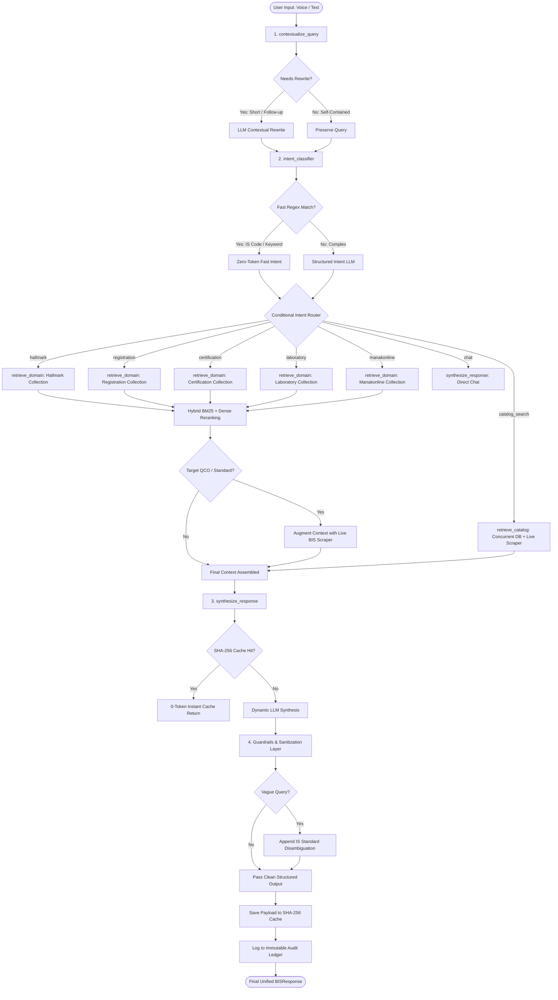

# 🧠 BIS SATHI — Architectural Brain & System Specification
> **Bureau of Indian Standards (BIS) Agentic RAG Assistant (Voice & Text)**  
> *Production-Ready, Multi-Provider, Autonomous Regulatory Intelligence & Compliance Assistant*

---

## 📑 Table of Contents
1. [Executive Overview](#1-executive-overview)
2. [Full Technology Stack](#2-full-technology-stack)
3. [System Architecture & Directory Topology](#3-system-architecture--directory-topology)
4. [End-to-End Workflow & Execution Pipelines](#4-end-to-end-workflow--execution-pipelines)
   - [4.1 LangGraph StateGraph Execution Pipeline](#41-langgraph-stategraph-execution-pipeline)
   - [4.2 Real-Time SSE Token Streaming Flow](#42-real-time-sse-token-streaming-flow)
   - [4.3 Multimodal Voice Processing Pipeline](#43-multimodal-voice-processing-pipeline)
   - [4.4 Dual Storage & Hybrid Retrieval Flow](#44-dual-storage--hybrid-retrieval-flow)
5. [Core Features](#5-core-features)
6. [Special & Proprietary Features](#6-special--proprietary-features)
7. [Regulatory Guardrails & Compliance Defensibility](#7-regulatory-guardrails--compliance-defensibility)
8. [Database Schema & Data Model](#8-database-schema--data-model)
9. [REST API Specification](#9-rest-api-specification)
10. [Deployment & Infrastructure](#10-deployment--infrastructure)

---

## 1. Executive Overview

**BIS SATHI** is an enterprise-grade, agentic Conversational AI & Regulatory Intelligence system built for manufacturers, importers, lab testing personnel, and consumers interacting with the **Bureau of Indian Standards (BIS)** and the **Ministry of Consumer Affairs, Food & Public Distribution**.

Operating across web, voice, and REST APIs, BIS SATHI automates compliance discovery across Indian Standards (IS), mandatory Quality Control Orders (QCOs), the Compulsory Registration Scheme (CRS), Foreign Manufacturers Certification Scheme (FMCS), Gold & Silver Hallmarking (HUID), and the Manakonline portal ecosystem.

The system combines **LangGraph** orchestration, **hybrid sparse-dense retrieval (BM25 + PGVector/Chroma)**, **live regulatory web scrapers**, **deterministic output guardrails**, **multi-provider BYOK LLM switching**, **SHA-256 immutable audit logging**, and **automated ReportLab compliance PDF dossier compilation**.

---

## 2. Full Technology Stack

### 2.1 Backend & Orchestration
| Component | Technology | Version / Specification | Role in System |
| :--- | :--- | :--- | :--- |
| **Language Runtime** | Python | `>= 3.10` (Windows / Linux) | Core application execution environment |
| **API Framework** | FastAPI | `>= 0.110.0` | Asynchronous high-throughput REST API & OpenAPI docs |
| **ASGI Web Server** | Uvicorn | `>= 0.28.0` (Standard) | High-concurrency ASGI server with auto-reload |
| **Middleware Layer** | Starlette CORS & GZip | Integrated | Cross-Origin handling & response compression (`> 1KB`) |
| **Workflow Engine** | LangGraph | `>= 0.1.0` (`StateGraph`) | Cyclical / conditional multi-node agent orchestration |
| **LLM Core Framework** | LangChain Core & Community | `>= 0.2.0` | Prompt management, document abstractions, message models |
| **Validation & Typing** | Pydantic & Pydantic-Settings | `>= 2.7.0` (V2) | Request/response schema validation and environment loading |

### 2.2 LLM Providers & Embeddings (Multi-Provider & BYOK)
| Component | Provider / Library | Model / Integration | Capability |
| :--- | :--- | :--- | :--- |
| **Primary Default LLM** | Google Gemini (`langchain-google-genai`) | `gemini-3.5-flash` / `gemini-pro-latest` | High-speed structured synthesis & reasoning |
| **Alternative Cloud LLMs** | Mistral AI (`langchain-mistralai`) | `mistral-large`, `mistral-small` | High-fidelity European multilingual compliance reasoning |
| **Enterprise Cloud LLMs** | OpenAI (`langchain-openai`) | `gpt-4o`, `gpt-4o-mini`, `o1`, `o3` | Zero-shot regulatory reasoning & complex comparative tables |
| **Aggregator API** | OpenRouter (`langchain-openai` base) | Multi-model routing | Bring-Your-Own-Key support across 100+ AI models |
| **Local Private LLM (Offline)** | Ollama (`langchain-ollama`) | `llama3.2`, `qwen2.5`, `deepseek-r1:8b`, `phi4` | 100% data-sovereign, air-gapped regulatory processing |
| **Dense Embeddings** | Mistral / Google / FastEmbed / Ollama | `mistral-embed-2312` / `fastembed` ONNX / `text-embedding-004` | 1024/1536-dim semantic representation ($0.00 local ONNX option) |

### 2.3 Vector Database, Search & Caching
| Component | Technology | Implementation Detail |
| :--- | :--- | :--- |
| **Cloud Vector Database** | Supabase PostgreSQL + `pgvector` | `langchain-postgres`, psycopg3 driver with `prepare_threshold=None` for PgBouncer |
| **Local Vector Database** | ChromaDB (`langchain-chroma`) | `>= 0.5.0`, persistent local SQLite-backed HNSW vector store |
| **Sparse Keyword Search** | BM25 (`rank-bm25`) | `BM25Okapi` in-memory domain-level sparse inverted indexes |
| **Reranking Algorithm** | Cosine Similarity Reranker | Numpy-accelerated dense-sparse fusion reranking |
| **Response Cache** | Persistent SHA-256 Cache | Multi-key JSON & Supabase database cache with 0-token instant bypass |

### 2.4 Live Web Scraping & Regulatory Ingestion
| Component | Technology | Target Endpoints & Functions |
| :--- | :--- | :--- |
| **HTTP Client** | Requests & HTTPX | Timeout-resilient HTTP sessions with custom browser user-agents |
| **HTML Parser** | BeautifulSoup4 (bs4) | Scrapes DOM from official portals for circulars, notices, and STI guides |
| **Headless Browser** | Playwright (`playwright`) | Dynamic JavaScript rendering for interactive government forms |
| **Official BIS API** | `standards.bis.gov.in` | Native JSON search API with multi-token keyword relevance scoring |
| **CRS Portal Ingestion** | `crsbis.in` | Live electronic product category & standard status scraping |

### 2.5 Voice & Multimodal Audio
| Component | Technology | Implementation Detail |
| :--- | :--- | :--- |
| **Speech-to-Text (STT)** | OpenAI Whisper (`base` / `small`) | Offline PyTorch-backed local transcription for `.wav`, `.mp3`, `.m4a`, `.ogg`, `.webm` |
| **Audio I/O** | `sounddevice` & `soundfile` | Low-latency microphone recording via NumPy buffers |
| **Text-to-Speech (TTS)** | `pyttsx3` & Web Speech API | Native OS voice synthesis (SAPI5 on Windows) & in-browser Web Speech |

### 2.6 Document & PDF Generation
| Component | Technology | Styling & Formatting |
| :--- | :--- | :--- |
| **PDF Dossier Engine** | ReportLab (`reportlab>=4.0.0`) | Programmatic vector PDF compilation with official BIS navy/amber palette |
| **Pagination Decorator** | Custom `NumberedCanvas` | Running two-pass "Page X of Y" canvas with dynamic running headers & footers |
| **Parser & Ingest** | `pypdf` | Extracts structural text, clauses, and amendments from raw gazettes |

### 2.7 Frontend Application
| Component | Technology | Details |
| :--- | :--- | :--- |
| **Framework** | React 19 (`react`, `react-dom`) | Modern component architecture, hooks, and Concurrent Mode |
| **Build Tooling** | Vite 8 (`vite`, `@vitejs/plugin-react`) | Sub-millisecond HMR and optimized production bundling |
| **Language** | TypeScript 6 (`typescript`) | Strict type-safety across requests, responses, and UI states |
| **Icons** | Lucide React (`lucide-react`) | Streamlined feather-style SVG iconography |
| **Design System** | Bespoke Vanilla CSS | Custom design system with glassmorphism, responsive grid, dynamic dark/light theme |
| **Linter** | Oxlint (`oxlint`) | Ultra-fast Rust-based static code analysis |

---

## 3. System Architecture & Directory Topology

```
c:\python\BIS_AGENT\
├── app.py                          # FastAPI REST application definition, endpoints & SSE routes
├── main.py                         # High-level interactive CLI & Voice REPL entry point
├── server.py                       # Production Uvicorn server launcher
├── test_api.py                     # Automated integration test suite for REST endpoints
├── test_scraper.py                 # Standalone validation script for live BIS portal scrapers
├── requirements.txt                # Unified Python dependency specification
├── Dockerfile                      # Production container build with audio & system libs
├── Procfile                        # Heroku / PaaS process declaration
├── docker-compose.yml              # Multi-container orchestration (FastAPI + PGVector)
├── render.yaml                     # Render PaaS web service deployment specification
├── data/
│   ├── audit_log.jsonl             # Tamper-evident local immutable audit trail
│   ├── cache.json                  # SHA-256 persistent disk response cache
│   ├── chroma_db/                  # Local Chroma vector database collections
│   └── procedures/                 # Source regulatory PDFs & TXTs (IS standards, manuals)
├── backend/
│   ├── db/
│   │   ├── schema.sql              # Supabase PostgreSQL DDL (users, sessions, audit, cache)
│   │   └── supabase_client.py      # Async connection pooling, Auth, DB operations
├── src/
│   ├── config.py                   # Centralized configuration & environment validation
│   ├── schemas.py                  # Pydantic schemas (BISResponse, AgentState, TokenTracker)
│   ├── agent/
│   │   ├── graph.py                # LangGraph StateGraph assembly, conditional routing & nodes
│   │   ├── nodes.py                # Node implementations, prompts, synthesis & fast classification
│   │   ├── guardrails.py           # Deterministic validation layer, legal checks & URL integrity
│   │   ├── session.py              # Multi-turn session state, rate limiting & Supabase sync
│   │   └── llm_factory.py          # Multi-provider LLM factory (Gemini, Mistral, OpenAI, Ollama)
│   ├── audio/
│   │   └── handler.py              # Whisper STT & Pyttsx3 TTS audio pipeline
│   ├── ingestion/
│   │   ├── build_vectordb.py       # Vector DB construction & chunking pipeline
│   │   ├── crawler.py              # Web crawler for official BIS portals & gazettes
│   │   └── download_docs.py        # Automated downloader for standards documents & PDFs
│   └── tools/
│       ├── audit.py                # Immutable AuditLogger with SHA-256 payload hashing
│       ├── cache.py                # Thread-safe persistent response cache manager
│       ├── pdf_generator.py        # ReportLab 13-section technical compliance PDF compiler
│       ├── retriever.py            # Hybrid BM25 + dense vector retrieval & cosine reranking
│       ├── scraper.py              # Multi-source live BIS, QCO, and CRS web scrapers
│       └── vector_store.py         # Dual vector store abstraction (PGVector & ChromaDB)
└── frontend/
    ├── package.json                # React 19 + Vite + TypeScript dependencies
    ├── vite.config.ts              # Vite configuration & proxy routes
    └── src/
        ├── App.tsx                 # Root application state, view switching, audio controllers
        ├── index.css               # Design system, glassmorphism, animations, CSS variables
        ├── types.ts                # TypeScript interfaces mirroring backend Pydantic models
        └── components/
            ├── Header.tsx          # Top navigation, model status badge, user auth buttons
            ├── LandingPage.tsx     # Rich interactive portal with scheme explorer & quick prompts
            ├── ChatWindow.tsx      # Real-time chat, SSE stream rendering, PDF download triggers
            ├── SessionSidebar.tsx  # Multi-session navigation, history drawer & management
            ├── TelemetryPanel.tsx  # Live latency, token burn metrics, cache hit indicators
            ├── AuditLedgerModal.tsx# Immutable compliance audit log viewer with SHA-256 hashes
            ├── UserProfileModal.tsx# BYOK model selector, API key tester, password manager
            ├── AuthModal.tsx       # Modal for user signup and email/password authentication
            └── VoiceRecorderModal.tsx # Microphone recorder modal with live transcription preview
```

---

## 4. End-to-End Workflow & Execution Pipelines

### 4.1 LangGraph StateGraph Execution Pipeline



#### Detailed Stage Breakdown:
1. **Contextualization (`contextualize_query`)**:
   - Evaluates whether the incoming query is dependent on prior turns (e.g., *"what about fees?"*, *"is this mandatory?"*, *"haan aur batao"*).
   - If self-contained, completely skips LLM rewriting to conserve tokens.
   - If dependent, rewrites the question into a standalone query maintaining Hindi, Hinglish, or English nuances.
2. **Intent Classification (`intent_classifier`)**:
   - **Zero-Token Fast Path**: Uses regex heuristics (`_fast_classify`) matching exact IS codes (`IS 1417`, `IS 269`), greetings, and domain keywords. Resolves **~90%** of real queries with zero LLM calls.
   - **LLM Fallback**: Invokes a lightweight structured prompt classifying the query into one of 7 canonical categories:
     - `hallmark`: Assaying, Gold/Silver, HUID, jewellery purity.
     - `registration`: MeitY Compulsory Registration Scheme (CRS), electronics, IT goods.
     - `certification`: Scheme-I (ISI Mark), FMCS (Foreign Manufacturers), QCOs, CML numbers.
     - `laboratory`: Testing laboratories, LRS, LIMS, NABL accreditation.
     - `manakonline`: e-BIS portal, login, document upload, online filing.
     - `catalog_search`: Product specifications, pipes, cement, steel, batteries, helmets.
     - `chat`: Greetings, help queries, general pleasantries.
3. **Retrieval Nodes (`retrieve_domain` & `retrieve_catalog`)**:
   - **Domain Collections**: Fetches documents from the domain's vector store (PGVector or Chroma), runs BM25 sparse retrieval over in-memory indexes, and computes cosine-similarity reranking.
   - **Live Augmentation**: Automatically queries live BIS web scrapers if query targets recent QCOs, circulars, or specific standards.
   - **Catalog Retrieval**: Executes concurrent threads (`ThreadPoolExecutor(max_workers=2)`) combining vector retrieval and live BIS portal scraping.
4. **Synthesis & Special Prompting Modes (`synthesize_response`)**:
   - **Research Dossier Mode**: Triggers when comprehensive analysis is requested, enforcing a complete 13-section technical publication-grade format.
   - **Difference & Versus Mode**: Enforces mandatory multi-column Markdown comparison tables comparing regulatory dimensions (Legal Scheme, Conformity Model, Testing, Factory Audit, Mark/Logo, Validity, AIR rules).
   - **Standard Compliance Mode**: Enforces a two-tier structured breakdown (Overview paragraph + Main Bullet Points with nested numbered items).
   - **Multilingual Matching**: Strictly matches Hindi (Devanagari), natural Hinglish (Roman script), or English.
5. **Deterministic Guardrails & Audit**:
   - Scores intent confidence; if `< 0.75` or query is ambiguous, injects targeted standard options (e.g. pipe -> HDPE vs UPVC vs Steel).
   - Enforces legal citation accuracy (Bureau of Indian Standards Act, 2016).
   - Validates official URLs (`manakonline.in`, `crsbis.in`, `bis.gov.in`).
   - Appends SHA-256 digests to immutable audit logs.

---

### 4.2 Real-Time SSE Token Streaming Flow
Endpoint: `POST /api/v1/query/stream`

```
Client (Browser / React)                        FastAPI Server (/api/v1/query/stream)
       |                                                              |
       |--- POST { query, session_id, user_id, BYOK_config } -------->|
       |                                                              |
       |                   [Check In-Memory & Supabase User Config]   |
       |                   [Session: Initialize / Fetch isolated]     |
       |                                                              |
       |<-- data: {"type": "intent", "intent": "certification"} ------| (Event: Intent Classified)
       |<-- data: {"type": "status", "stage": "retrieving"} ----------| (Event: Search Active)
       |<-- data: {"type": "token", "token": "According "} -----------| (Event: LLM Token Stream)
       |<-- data: {"type": "token", "token": "to the "} --------------|
       |<-- data: {"type": "token", "token": "BIS Act, 2016..."} -----|
       |                                                              |
       |<-- data: {"type": "final_output", "output": BISResponse} ----| (Event: Full Structured JSON)
       |                                                              |
```

---

### 4.3 Multimodal Voice Processing Pipeline
Endpoint: `POST /api/v1/voice-query` & Local CLI Audio Loop

```
Microphone / Audio File Upload (.wav, .mp3, .m4a, .webm)
               │
               ▼
LocalAudioHandler (src/audio/handler.py)
   ├── PyTorch Audio Buffer Pre-processing
   └── OpenAI Whisper Transcription Engine (Offline 'base' model)
               │
               ▼ (Extracted Query Text)
LangGraph Conversational Session Turn (run_turn)
               │
               ▼ (Synthesized Structured Response)
Text Output ───┬──> Browser Web Speech Synthesis API (Audio Playback)
               └──> pyttsx3 Local Desktop TTS Engine (SAPI5 / nsss)
```

---

### 4.4 Dual Storage & Hybrid Retrieval Flow

```
User Query: "What is the standard for HDPE water supply pipe?"
                             │
            ┌────────────────┴────────────────┐
            ▼                                 ▼
   Sparse BM25 Index                  Dense Embeddings
   (rank-bm25 Okapi)              (Mistral / FastEmbed ONNX)
            │                                 │
   Top-K Keyword Matches             Top-K Vector Nearest Neighbors
   (Exact term overlap)              (Supabase PGVector / ChromaDB)
            │                                 │
            └────────────────┬────────────────┘
                             ▼
              Reciprocal Rank / Cosine Fusion
                             │
                             ▼
                  Reranked Top-N Context
                             │
                             ▼
              Live BIS Scraper Augmentation
             (Know Your Standards JSON API)
                             │
                             ▼
              Final Prompt Context to LLM
```

---

## 5. Core Features

### 1. Unified 7-Intent Architecture
- Comprehensive coverage across all statutory BIS functions:
  - **Hallmarking (`hallmark`)**: Gold & silver jewelry assaying, 6-digit alphanumeric HUID regulations, Hallmarking Center (AHC) setup, purity grades (24K/999, 22K/916, 18K/750, 14K/585).
  - **Compulsory Registration (`registration`)**: MeitY/MNRE CRS requirements for laptops, chargers, mobile phones, batteries, solar panels, and smartwatches. Self-Declaration of Conformity (SDoC).
  - **Product Certification (`certification`)**: Scheme-I (ISI Mark), Scheme-IV, Foreign Manufacturers Certification Scheme (FMCS), CML issuance, factory audits, and QCO mandates.
  - **Laboratory Testing (`laboratory`)**: Laboratory Recognition Scheme (LRS), LIMS, NABL test report guidelines, testing parameters, and sample drawing.
  - **Manakonline Portal (`manakonline`)**: Procedural guidance for e-BIS, user registration, online document submission, application fee calculation, and status tracking.
  - **Catalog Search (`catalog_search`)**: Deep retrieval over thousands of Indian Standards covering cement, steel, pipes, toys, helmets, cables, and packaging.
  - **Conversational Chat (`chat`)**: Natural greetings, capability explanations, and conversational assistance.

### 2. Multi-Session Isolated Memory
- Dedicated per-user session isolation: Sessions are keyed strictly by composite tuples `(user_id, session_id)`.
- Sliding context window tracking prior turns with intelligent reference preservation.
- Hard rate-limiting caps (50 turns per session, 50,000 token limit per session) preventing runaway usage and API exhaustion.

### 3. Responsive Multi-Turn Conversational Interface
- Modern React 19 interface featuring:
  - Markdown table rendering with horizontal scroll protection.
  - Real-time SSE token-by-token streaming with smooth typewriter animations.
  - One-click copy, speech playback, follow-up suggestion buttons, and official portal links.
  - Live session sidebar with search, delete, and session creation.

### 4. Interactive Telemetry & Token Cost Accounting
- Live UI telemetry panel and API response headers (`X-Process-Time-Ms`) detailing:
  - Turn latency in milliseconds and seconds.
  - Turn prompt, completion, and embedding tokens.
  - Session cumulative token burn vs. tokens saved via caching.
  - Active LLM model, provider status, and vector database connectivity.

---

## 6. Special & Proprietary Features

### ⚡ 1. Zero-Token Instant Cache Bypass
- Repeated queries (exact or semantic variations) are matched against a multi-key persistent SHA-256 cache.
- Delivers instantaneous responses (`< 50ms`) with **0 LLM API tokens burned**, drastically reducing cloud operating costs.
- Automatically bypasses caching for comprehensive research queries to ensure users always receive freshly updated regulatory notifications.

### 🌐 2. Autonomous Multi-Source Regulatory Web Scraper
- Real-time scraper targeting live statutory portals:
  - **Know Your Standards API**: Directly interfaces with `standards.bis.gov.in` extracting live standard numbers, publication dates, and active amendments.
  - **Quality Control Order (QCO) Registry**: Retrieves mandatory implementation deadlines and gazette notifications across DPIIT, Ministry of Steel, MeitY, and Ministry of Chemicals.
  - **CRS Electronics Matrix**: Scrapes `crsbis.in` for the latest product inclusions and testing standards.
  - **Scheme & Fee Schedules**: Automatically retrieves application fees, annual marking fees, and statutory 50% MSME/Start-up financial concessions.

### 📑 3. Comprehensive 13-Section Research Dossier Engine
- Automatically triggered on research requests (*"compliance report"*, *"research dossier"*, *"in-depth analysis"*).
- Compiles exhaustive, publication-grade dossiers covering:
  1. Executive Summary & Statutory Basis (BIS Act, 2016)
  2. Current Regulatory Position & QCO Timelines
  3. Definition & Role of Application Standards
  4. High-Use Application Standards Matrix (Markdown Table)
  5. 8-Step BIS Certification Workflow (STI to Grant of Licence)
  6. Testing & Quality Control Requirements (In-house lab equipment & thresholds)
  7. Mandatory Application Documentation Checklist
  8. Special Regulations for Imports & Foreign Manufacturers (FMCS, AIR, $10k PBG)
  9. Amendment & Enforcement Watchlist
  10. Actionable 3-Phase Compliance Checklist for Manufacturers & Buyers
  11. Selected Standards Reference List
  12. Source-Based Technical Highlights & Failure Modes
  13. Official Verification Links & BIS Care App Verification

### 📄 4. One-Click ReportLab Compliance PDF Generator
- Direct endpoint (`POST /api/v1/export/pdf`) generating downloadable, print-ready PDF dossiers.
- Engineered with ReportLab using a custom `NumberedCanvas` delivering:
  - Official BIS theme palette (Deep Navy `#0f2b5c`, Regulatory Amber `#d97706`).
  - Two-pass dynamic page numbering (`Page X of Y`).
  - Running headers and legal disclaimer footers.
  - Cleanly styled parameter tables, callout blocks, and compliance metadata cards.

### 🔑 5. Bring Your Own Key (BYOK) & Multi-Model Engine
- Dynamic LLM factory supporting real-time runtime switching:
  - **Google Gemini**: `gemini-3.5-flash`, `gemini-pro-latest`
  - **Mistral AI**: `mistral-large`, `mistral-small`
  - **OpenAI**: `gpt-4o`, `gpt-4o-mini`, `o1`, `o3`
  - **OpenRouter**: Access to Claude 3.5 Sonnet, Llama 3.3 70B, etc.
  - **Ollama**: 100% offline, local execution with `llama3.2`, `qwen2.5`, `deepseek-r1`
- Built-in connection testing endpoint (`POST /api/v1/auth/test-model-connection`) verifying user keys before execution.

### 🔒 6. Tamper-Evident Immutable Audit Ledger
- Every conversation turn is hashed using SHA-256 across the input prompt and output payload.
- Stored both in an append-only local ledger (`data/audit_log.jsonl`) and asynchronously synchronized to Supabase PostgreSQL.
- Provides defensible, verifiable audit trails for enterprise legal teams and compliance audits.

### 🗣 7. Multilingual & Hinglish Native Voice Loop
- True multilingual conversational engine supporting:
  - Pure Hindi (Devanagari script) with localized intent labeling (e.g., *'हॉलमार्क पंजीकरण'*).
  - Natural conversational Hinglish (Roman script, e.g., *"Gold jewellery ke liye licence kaise milega?"*).
  - Formal English technical standards jargon.
- Coupled with Whisper speech-to-text and dual audio output mechanisms.

---

## 7. Regulatory Guardrails & Compliance Defensibility

The deterministic guardrail layer (`src/agent/guardrails.py`) validates every generated response before it reaches the client:

```mermaid
flowchart LR
    RawResp[Raw Synthesized Response] --> ConfCheck{Confidence Scoring}
    ConfCheck -- Confidence < 0.75 / Ambiguous --> Disambig[Trigger Proactive Disambiguation]
    ConfCheck -- High Confidence --> URLCheck
    Disambig --> URLCheck{Official URL Integrity}
    URLCheck -- Unauthorized URL Found --> ReplaceURL[Replace with https://manakonline.in]
    URLCheck -- Verified Domains --> LegalCheck{Statutory Act Check}
    ReplaceURL --> LegalCheck
    LegalCheck -- Misattribution Detected --> FixLegal[Enforce BIS Act, 2016 Citation]
    LegalCheck -- Valid Citation --> PydanticVal[Pydantic Guarantee Validation]
    FixLegal --> PydanticVal
    PydanticVal --> SanitizedOutput[Defensible Sanitized BISResponse]
```



1. **Proactive Disambiguation**: When users ask broad or vague questions (e.g. *"pipe"*, *"cement"*, *"helmet"*, *"tank"*), the guardrail intercepts the output and provides numbered standard options (e.g., HDPE pipe [IS 4984] vs UPVC pipe [IS 4985] vs Steel tubes [IS 1239]).
2. **URL Integrity Enforcement**: Guarantees that links provided in answers point strictly to verified official government portals (`manakonline.in`, `crsbis.in`, `bis.gov.in`). Any extraneous or unverified domains are automatically sanitized.
3. **Statutory Legal Precision**: Intercepts penalty citations to prevent misattribution to the Consumer Protection Act, strictly enforcing citations under **Section 29 of the Bureau of Indian Standards Act, 2016** (up to 2 years imprisonment, fines up to ₹5 Lakhs, or up to 10x value of goods).
4. **Table Delimiter Auto-Formatting**: Normalizes collapsed Markdown tables, guaranteeing clean pipe delimiters (`|`) and newlines for frontend rendering.

---

## 8. Database Schema & Data Model

The PostgreSQL backend (Supabase) runs on an optimized relational and vector schema:

```sql
-- Extensions
CREATE EXTENSION IF NOT EXISTS "uuid-ossp";
CREATE EXTENSION IF NOT EXISTS vector;

-- 1. Users & Authentication
CREATE TABLE IF NOT EXISTS users (
    user_id TEXT PRIMARY KEY,
    email TEXT UNIQUE NOT NULL,
    full_name TEXT NOT NULL,
    password_hash TEXT NOT NULL,
    role TEXT DEFAULT 'user',
    total_tokens_burned INT DEFAULT 0,
    total_queries_count INT DEFAULT 0,
    created_at TIMESTAMPTZ DEFAULT NOW()
);

-- 2. Isolated Conversation Sessions
CREATE TABLE IF NOT EXISTS sessions (
    session_id TEXT PRIMARY KEY,
    user_id TEXT DEFAULT 'default_user',
    created_at TIMESTAMPTZ DEFAULT NOW(),
    updated_at TIMESTAMPTZ DEFAULT NOW(),
    active_product_context TEXT DEFAULT '',
    turn_count INT DEFAULT 0,
    history JSONB DEFAULT '[]'::jsonb
);

-- 3. Immutable Compliance Audit Ledger
CREATE TABLE IF NOT EXISTS audit_logs (
    interaction_id TEXT PRIMARY KEY,
    user_id TEXT DEFAULT 'default_user',
    timestamp_utc TIMESTAMPTZ DEFAULT NOW(),
    session_id TEXT NOT NULL,
    user_query TEXT NOT NULL,
    standalone_query TEXT,
    prompt_sha256 TEXT,
    intent TEXT,
    intent_localized TEXT,
    model_checkpoint TEXT,
    embedding_provider TEXT,
    cache_hit BOOLEAN DEFAULT FALSE,
    response_time_ms DOUBLE PRECISION DEFAULT 0.0,
    confidence_metrics JSONB DEFAULT '{}'::jsonb,
    compliance_metadata JSONB DEFAULT '{}'::jsonb,
    token_usage JSONB DEFAULT '{}'::jsonb,
    payload_sha256 TEXT,
    payload JSONB DEFAULT '{}'::jsonb
);

-- 4. Persistent Response Cache
CREATE TABLE IF NOT EXISTS response_cache (
    cache_key TEXT PRIMARY KEY,
    intent TEXT,
    query_text TEXT,
    cached_payload JSONB NOT NULL,
    created_at TIMESTAMPTZ DEFAULT NOW()
);
```

---

## 9. REST API Specification

| HTTP Method | Route | Tag | Description |
| :--- | :--- | :--- | :--- |
| `GET` | `/health` | Diagnostics | System status, model configurations, DB & Supabase connectivity |
| `GET` | `/` | Diagnostics | Serves React production frontend or JSON health status |
| `POST` | `/api/v1/auth/signup` | Authentication | Registers a new user account with hashed password storage |
| `POST` | `/api/v1/auth/login` | Authentication | Authenticates email/password credentials |
| `POST` | `/api/v1/auth/change-password` | Authentication | Updates existing user password with salt verification |
| `GET` | `/api/v1/auth/user-usage/{user_id}` | Authentication | Calculates lifetime account token burn and query count |
| `POST` | `/api/v1/auth/user-model-config`| Authentication | Persists user-specific BYOK AI model configurations |
| `POST` | `/api/v1/auth/test-model-connection`| Authentication| Instantiates target model to verify API key validity |
| `POST` | `/api/v1/query` | Conversational Agent | Executes standard turn through LangGraph RAG workflow |
| `POST` | `/api/v1/query/stream` | Conversational Agent | Real-time Server-Sent Events (SSE) streaming output |
| `POST` | `/api/v1/voice-query` | Conversational Agent | Uploads audio clip, transcribes via Whisper, processes query |
| `GET` | `/api/v1/sessions` | Session Management | Lists active conversation sessions for target user |
| `GET` | `/api/v1/sessions/{session_id}`| Session Management | Retrieves full conversation turn history for a session |
| `DELETE`| `/api/v1/sessions/{session_id}`| Session Management | Deletes session history from both memory and Supabase |
| `POST` | `/api/v1/cache/clear` | Cache Control | Flushes persistent SHA-256 response cache |
| `GET` | `/api/v1/audit-logs` | Compliance & Audit | Fetches structured immutable legal audit records |
| `POST` | `/api/v1/export/pdf` | Compliance & Audit | Generates and streams official ReportLab compliance PDF |

---

## 10. Deployment & Infrastructure

### 10.1 Containerized Deployment (`Dockerfile`)
- Multi-stage build based on `python:3.11-slim`.
- Includes required system packages: `ffmpeg`, `libsndfile1`, `curl`, and `git`.
- Automatically serves both the compiled React frontend (`frontend/dist`) and FastAPI backend under a unified port.

### 10.2 Single-Service Cloud Deployment (Render / Heroku)
- Configured via `render.yaml` and `Procfile`:
  ```bash
  web: uvicorn app:app --host 0.0.0.0 --port $PORT --workers 1
  ```
- Build Command:
  ```bash
  pip install -r requirements.txt && cd frontend && npm install && npm run build && cd ..
  ```

### 10.3 Air-Gapped / Sovereign Enterprise Setup
- **Vector DB**: Local ChromaDB on NVMe storage (`data/chroma_db`).
- **Embeddings**: Local ONNX Runtime via `FastEmbed` (`BAAI/bge-small-en-v1.5`) — zero network calls.
- **LLM**: Local Ollama instance serving `llama3.2` or `deepseek-r1` via internal LAN (`http://localhost:11434`).
- **Audio**: Local Whisper `base` model running directly on host CPU/CUDA.

---

*Authored for Bureau of Indian Standards (BIS) AI Systems Engineering & SIH Initiative.*
